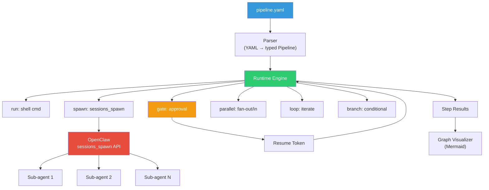
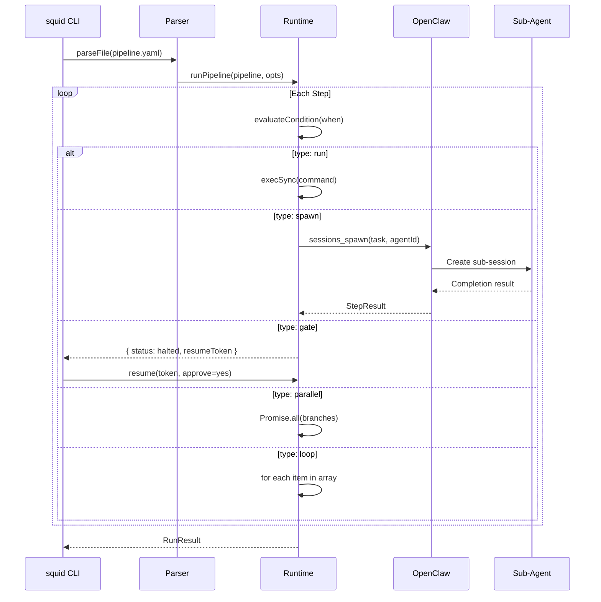

# Squid

**Agentic pipeline framework with pluggable agent runtimes** — inspired by Lobster, built for modern multi-agent workflows.

Squid lets you define multi-agent workflows in YAML with native sub-agent spawning, approval gates, parallel execution, loops, branching, and retries. Spawn steps work with **OpenClaw**, **Claude Code**, **OpenCode**, or any custom agent runtime. No Bash glue needed.

## Architecture



### Execution Flow



## Install

```bash
# From source
git clone <repo>
cd squid
npm install
npm run build

# Run
npx squid run pipeline.yaml
# or in dev mode
npm run dev -- run pipeline.yaml
```

## Why Squid?

**The problem**: Building multi-agent workflows today means gluing together shell scripts, manually calling LLM APIs, and hoping nothing breaks between steps. Existing tools lack sub-workflows, have no testing story, and lock you into a single agent runtime.

**Squid fixes this**:

- **Any agent runtime** — not locked to one vendor. Use OpenClaw, Claude Code, OpenCode, or plug in your own. Mix them in one pipeline.
- **YAML, not code** — define complex multi-agent workflows in readable YAML. No Bash glue, no Python scripts, no orchestration code.
- **Every step is testable** — `.test.yaml` files with sandbox mode (nothing executes) and integration mode. Mock any step. Zero agent calls needed for tests.
- **Sub-pipelines** — break large workflows into reusable `.yaml` files. Each is standalone and independently testable.
- **Human-in-the-loop done right** — approval gates with structured input fields (forms, not just yes/no), caller identity verification, and chat-friendly 8-char short IDs for Telegram/Discord/Slack.
- **Iterative refinement** — `restart:` jumps back to a previous step when quality isn't met. Agent writes code, reviewer scores it, pipeline loops back with feedback until threshold is reached.
- **Observability built in** — every step emits lifecycle events with OTel-compatible trace/span IDs. Wire up Slack alerts, PagerDuty, dashboards, or audit trails.
- **Resilient by default** — retry with exponential-jitter backoff, parallel execution with concurrency limits, conditional branching, and pipeline-level error strategies.

**Who it's for**: AI developers building multi-agent workflows — dev bots, content pipelines, deployment automation, data processing — on any platform.

## Quick Start

### 1. Define a pipeline

```yaml
# deploy.yaml
name: deploy
args:
  env:
    default: staging
  image:
    required: true

steps:
  - id: build
    type: run
    run: docker build -t ${args.image} .
    retry: 2

  - id: test
    type: run
    run: docker run --rm ${args.image} npm test

  - id: approve
    type: gate
    gate: "Deploy ${args.image} to ${args.env}?"

  - id: deploy
    type: run
    run: kubectl set image deployment/app app=${args.image} -n ${args.env}
    when: $approve.approved
```

### 2. Run it

```bash
squid run deploy.yaml --args-json '{"image": "myapp:v2"}'
```

### 3. Resume after approval

```bash
squid resume deploy.yaml --token <token> --approve yes
```

### 4. Visualize

```bash
squid viz deploy.yaml
```

## Step Types

| Type | Description | Key Config |
|------|-------------|------------|
| `run` | Execute a shell command | `run: "command"` |
| `spawn` | Spawn AI sub-agent (OpenClaw, Claude Code, OpenCode, custom) | `spawn: { task, agent, model, timeout }` |
| `gate` | Human approval with structured input + identity | `gate: { prompt, input, requiredApprovers }` |
| `parallel` | Fan-out concurrent branches | `parallel: { branches, maxConcurrent, merge }` |
| `loop` | Iterate over array items | `loop: { over, as, steps, maxConcurrent }` |
| `branch` | Conditional routing | `branch: { conditions: [{ when, steps }], default }` |
| `transform` | Inline data transformation | `transform: "$step.json.field"` |
| `pipeline` | Run a sub-pipeline YAML | `pipeline: { file, args }` |

## Data Flow

Reference outputs from previous steps:

```yaml
- id: fetch
  type: run
  run: curl -s https://api.example.com/data

- id: process
  type: spawn
  input: $fetch.json              # Pass fetch output to spawn
  spawn:
    task: "Process this data: ${fetch.json}"

- id: check
  type: branch
  branch:
    conditions:
      - when: $process.json.count > 10
        steps:
          - id: alert
            type: run
            run: notify "High count: ${process.json.count}"
```

### Reference Syntax

| Pattern | Resolves To |
|---------|-------------|
| `$stepId.json` | Parsed JSON output |
| `$stepId.stdout` | Raw stdout string |
| `$stepId.status` | Step status |
| `$stepId.approved` | Boolean (gate steps) |
| `$args.key` | Pipeline argument |
| `$env.VAR` | Environment variable |
| `$item` | Current loop item |
| `$index` | Current loop index |

## Retry

Any step can retry on failure:

```yaml
- id: flaky-api
  type: run
  run: curl https://flaky.example.com
  retry:
    maxAttempts: 3
    backoff: exponential-jitter    # fixed | exponential | exponential-jitter
    delayMs: 1000
    maxDelayMs: 30000
    retryOn: ["ECONNRESET", "timeout"]
```

## Parallel Execution

Fan out work and merge results:

```yaml
- id: analyze
  type: parallel
  parallel:
    maxConcurrent: 5
    failFast: true
    merge: object                    # object | array | first
    branches:
      security:
        - id: sec-scan
          type: spawn
          spawn: { task: "Run security audit" }
      performance:
        - id: perf-test
          type: run
          run: npm run benchmark
      lint:
        - id: lint
          type: run
          run: npm run lint
```

## Restart (Jump Back)

Any step can jump back to a previous step when a condition is met — enabling iterative refinement loops:

```yaml
steps:
  - id: write
    type: spawn
    spawn:
      task: |
        Implement: ${args.task}
        Prior feedback: ${review.json.feedback}

  - id: review
    type: spawn
    spawn:
      task: "Review the code. Score 0-100."
      thinking: high

  - id: decide
    type: transform
    transform: "$review.json.score"
    restart:
      step: write                      # jump back to this step
      when: $review.json.score < 80    # if this condition is true
      maxRestarts: 3                   # safety limit (default: 3)
```

Flow: `write → review → score=50 → RESTART → write(+feedback) → review → score=85 → continue`

- Target step must be **before** the current step (no forward jumps)
- Results between target and current are **cleared** on restart
- Previous iteration outputs are available via `$refs` (e.g., `${review.json.feedback}`)
- After `maxRestarts` exhausted, execution continues forward

See `skills/squid-pipeline/examples/iterative-refinement.yaml` for a full working example.

## Sub-Pipeline Composition

Run another YAML pipeline as a step. File paths resolve relative to the parent pipeline's directory.

```yaml
steps:
  - id: build
    type: pipeline
    pipeline:
      file: ./stages/build.yaml        # relative to THIS file
      args:
        target: $args.env              # pass parent args via $refs
        data: $fetch.json              # pass step outputs

  - id: deploy
    type: pipeline
    pipeline:
      file: ./stages/deploy.yaml
      args:
        artifact: $build.json.artifact
```

- Sub-pipeline output becomes the step's output (`$build.json`)
- Gates inside sub-pipelines propagate up — parent halts too
- Each sub-pipeline is standalone and independently testable

See `skills/squid-pipeline/examples/orchestrator.yaml` with `sub-build.yaml`, `sub-test.yaml`, `sub-deploy.yaml`.

## Testing

Two ways to test pipelines — no agent runtime needed.

### YAML Tests (recommended)

Write tests alongside your pipelines in `.test.yaml` files:

```yaml
# deploy.test.yaml
pipeline: ./deploy.yaml

tests:
  - name: "deploys when approved"
    mode: sandbox                  # nothing executes — pure logic test
    args: { env: staging, image: "app:v2" }
    mocks:
      run:
        build: { output: { built: true } }
        test: { output: { passed: true } }
      spawn:
        reviewer: { output: { score: 95 } }
    gates:
      approve: true
    assert:
      status: completed
      steps:
        deploy: completed

  - name: "skips deploy when rejected"
    mode: sandbox
    gates:
      approve: false
    assert:
      steps:
        deploy: skipped

  - name: "scripts actually run"
    mode: integration              # run steps execute, spawn steps mocked
    assert:
      status: completed
```

Run with:

```bash
squid test                         # auto-discovers all *.test.yaml files
squid test deploy.test.yaml        # run specific test file
```

**Two test modes:**

| Mode | `run` steps | `spawn` steps | `gate` steps |
|------|------------|---------------|--------------|
| **`sandbox`** | Mocked (nothing executes) | Mocked | Mock decisions |
| **`integration`** | Execute for real | Mocked | Mock decisions |

**Assertions:**

```yaml
assert:
  status: completed                           # pipeline status
  output: { deployed: true }                  # pipeline output
  steps:
    build: completed                          # step status (shorthand)
    review: { status: completed }             # step status (object)
    review: { output: { score: 95 } }         # exact output match
    review: { outputContains: "score" }        # output contains string
    review: { outputPath: score, equals: 95 }  # nested field check
```

### TypeScript Tests

For programmatic testing with vitest/jest:

```typescript
import { createTestRunner } from "squid/testing";
import { parseFile } from "squid";

const pipeline = parseFile("deploy.yaml");

const result = await createTestRunner()
  .mockSpawn("architect", { output: { plan: "..." } })
  .approveGate("review")
  .withArgs({ env: "test", image: "test:latest" })
  .run(pipeline);

result.assertStepCompleted("build");
result.assertStepCompleted("deploy");
```

See [docs/testing.md](docs/testing.md) for full reference.

## Advanced Gates

Gates go beyond approve/reject — collect structured input, enforce caller identity, and generate chat-friendly short IDs.

### Structured Input

Collect form fields from the approver:

```yaml
- id: deploy-config
  type: gate
  gate:
    prompt: "Configure deployment"
    input:
      - name: environment
        type: select
        options: ["staging", "production"]
      - name: replicas
        type: number
        default: 2
      - name: notify
        type: boolean
        default: true
      - name: version
        type: string
        validation: "^\\d+\\.\\d+\\.\\d+$"
```

Access input values: `$deploy-config.json.input.environment`, `$deploy-config.json.input.replicas`.

### Caller Identity

Restrict who can approve and prevent self-approval:

```yaml
- id: prod-gate
  type: gate
  gate:
    prompt: "Deploy to production?"
    requiredApprovers: ["platform-lead", "sre-oncall"]
    allowSelfApproval: false
```

### Short Approval IDs

Gates generate 8-character hex IDs (e.g., `a1b2c3d4`) alongside full resume tokens — designed for Telegram/Discord/Slack where button payloads are limited.

```json
{
  "shortId": "a1b2c3d4",
  "prompt": "Deploy myapp to production?",
  "inputFields": [...]
}
```

See `skills/squid-pipeline/examples/advanced-gates.yaml` for a complete example.

## Events / Observability

Pipeline execution emits lifecycle events for monitoring, OTel integration, and audit trails.

```typescript
import { createEventEmitter } from "squid";

const events = createEventEmitter();

// Listen to all events
events.on("*", (event) => {
  console.log(`[${event.type}] ${event.stepId ?? "pipeline"} (${event.duration ?? 0}ms)`);
});

// Or specific types
events.on("gate:waiting", (event) => {
  sendSlackMessage(`Approval needed: ${event.data?.prompt}`);
});

events.on("step:error", (event) => {
  alertOncall(`Step ${event.stepId} failed: ${event.data?.error}`);
});

const result = await runPipeline(pipeline, { events });
```

**Event types**: `pipeline:start`, `pipeline:complete`, `pipeline:error`, `step:start`, `step:complete`, `step:error`, `step:skip`, `step:retry`, `gate:waiting`, `gate:approved`, `gate:rejected`, `spawn:start`, `spawn:complete`.

**OTel-compatible fields**: Every event has `traceId` (= runId), `spanId`, `parentSpanId`, `timestamp`.

## Agent Adapters

Spawn steps are **not locked to OpenClaw**. Squid ships with three built-in agent adapters and supports custom ones.

### Built-in adapters

| Adapter | `agent:` value | What it calls | Install |
|---------|---------------|---------------|---------|
| **OpenClaw** | `openclaw` | `sessions_spawn` API or `openclaw` CLI | [openclaw.com](https://openclaw.com) |
| **Claude Code** | `claude-code` | `claude -p "task" --output-format json` | [claude.ai/claude-code](https://claude.ai/claude-code) |
| **OpenCode** | `opencode` | `opencode run --message "task"` | [opencode.ai](https://opencode.ai) |

### Set the agent per pipeline

```yaml
name: my-pipeline
agent: claude-code               # all spawn steps use Claude Code by default

steps:
  - id: analyze
    type: spawn
    spawn:
      task: "Analyze the codebase"
      # → runs: claude -p "Analyze the codebase"
```

### Override per step

```yaml
name: multi-agent
agent: claude-code               # default

steps:
  - id: research
    type: spawn
    spawn:
      task: "Research the topic"
      # → uses claude-code (inherited)

  - id: implement
    type: spawn
    spawn:
      agent: opencode            # override for this step
      task: "Implement the fix"
      # → runs: opencode run --message "Implement the fix"

  - id: review
    type: spawn
    spawn:
      agent: openclaw            # override for this step
      task: "Review the changes"
      agentId: code-reviewer     # OpenClaw-specific options still work
```

### Set default via environment

```bash
export SQUID_AGENT=claude-code
squid run pipeline.yaml      # all spawns use Claude Code
```

**Resolution order**: `step.agent` > `pipeline.agent` > `SQUID_AGENT` env > `openclaw`

### Register a custom adapter

```typescript
import { registerAdapter } from "squid";
import type { AgentAdapter } from "squid";

const myAdapter: AgentAdapter = {
  name: "my-agent",
  async spawn(config, ctx) {
    const result = await callMyAgentRuntime(config.task);
    return { status: "accepted", output: result };
  },
  async waitForCompletion() {
    return { stepId: "", status: "completed", output: {} };
  },
  async getSessionStatus() {
    return "completed";
  },
};

registerAdapter(myAdapter);
// Now use: agent: "my-agent" in any pipeline YAML
```

See [docs/adapters.md](docs/adapters.md) for full setup instructions for each adapter.

## Squid vs Lobster

| Feature | Lobster | Squid |
|---------|---------|------------|
| **Sub-agent Spawn** | Manual tool call via `openclaw.invoke` | Native `spawn:` block — pluggable adapters (OpenClaw, Claude Code, OpenCode, custom) |
| **Parallel Execution** | Not supported | `parallel:` with `maxConcurrent` |
| **Loops** | No native syntax | `loop:` with parallel iterations |
| **Conditional Branching** | Basic `when: $step.approved` | `branch:` with multi-condition routing |
| **Retry** | LLM-specific only | Any step, configurable backoff |
| **Error Handling** | Fail on first error | `onError: skip\|continue\|fail` per pipeline |
| **Data Flow** | `stdin: $step.json` | `input: $step.json` + `${step.json.field}` interpolation |
| **Conditions** | `$step.approved\|skipped` | Full expressions: `$a.count > 5 && $b.ready` |
| **Testing** | Script flags | Built-in `TestRunner` with mocks |
| **Visualization** | None | Mermaid graph export |
| **Sub-Pipelines** | Not supported | `pipeline:` for composable stages |
| **Restart / Jump Back** | Not supported | `restart:` for iterative refinement loops |
| **Resumability** | Opaque token + state dir | Self-contained base64 token |
| **Principles** | Partial SOLID | Full SOLID/DRY/KISS |
| **CLI** | `lobster run --file` | `squid run` (file auto-detected) |

## Verify Agent Spawning (E2E)

Test that agent adapters work with a real CLI:

```bash
# Quick verify — spawns a real Claude Code agent
squid run skills/squid-pipeline/examples/e2e/e2e-claude-code.yaml -v

# Expected output:
#   → [hello] spawn...
#   ✓ [hello] completed (3s)
#   → [verify] transform...
#   ✓ [verify] completed (0ms)
#   { "status": "completed", "output": { "status": "ok", "agent": "claude-code" } }
```

Run the full e2e test suite:

```bash
# Requires: claude CLI installed and authenticated
npm run test:e2e
```

E2E tests auto-detect which CLIs are installed and skip adapters that aren't available:

| Adapter | CLI needed | Auto-detected |
|---------|-----------|:-------------:|
| Claude Code | `claude` | Yes |
| OpenClaw | `openclaw` + running gateway | Yes |
| OpenCode | `opencode` | Yes |

E2e example pipelines are in `skills/squid-pipeline/examples/e2e/`.

## CLI Reference

```
squid run <file> [options]       Execute a pipeline
squid resume <file> [options]    Resume a halted pipeline
squid test [file.test.yaml]      Run pipeline tests (auto-discovers *.test.yaml)
squid validate <file>            Validate pipeline syntax
squid viz <file>                 Output Mermaid diagram
squid dev <file>                 Watch mode (dry-run on save)

Options:
  --args-json '{...}'    Pipeline arguments
  --dry-run              Show execution plan without running
  --test                 Use mock adapters
  -v, --verbose          Step-by-step progress output
  --cwd <dir>            Working directory override
```

## Environment Variables

| Variable | Description |
|----------|-------------|
| `SQUID_AGENT` | Default agent adapter: `openclaw`, `claude-code`, `opencode` |
| `OPENCLAW_URL` | OpenClaw gateway URL |
| `OPENCLAW_TOKEN` | Auth token for OpenClaw |
| `CLAUDE_MODEL` | Default model for Claude Code adapter |
| `OPENCODE_MODEL` | Default model for OpenCode adapter |
| `CLAWD_URL` | Fallback for `OPENCLAW_URL` |
| `CLAWD_TOKEN` | Fallback for `OPENCLAW_TOKEN` |

## Project Structure

```
squid/
├── bin/squid.js                # CLI entry point
├── src/
│   ├── index.ts                # Public API exports
│   ├── core/
│   │   ├── types.ts            # All type definitions (SOLID interfaces)
│   │   ├── parser.ts           # YAML/JSON → Pipeline (with validation)
│   │   ├── runtime.ts          # Pipeline execution engine
│   │   ├── expressions.ts      # $ref resolution & conditions
│   │   ├── resume.ts           # Resume token encode/decode
│   │   ├── graph.ts            # Mermaid visualization
│   │   ├── events.ts           # Event emitter (observability)
│   │   ├── gate-utils.ts       # Gate input validation, short IDs, identity
│   │   ├── openclaw-adapter.ts # OpenClaw HTTP/CLI adapter
│   │   ├── index.ts            # Core barrel exports
│   │   └── adapters/           # Pluggable agent adapters
│   │       ├── registry.ts     # Adapter registration & resolution
│   │       ├── claude-code.ts  # Claude Code CLI adapter
│   │       ├── opencode.ts     # OpenCode CLI adapter
│   │       ├── setup.ts        # Auto-register built-in adapters
│   │       └── index.ts        # Adapter barrel exports
│   ├── cli/
│   │   └── main.ts             # CLI commands (run, test, validate, viz, init, resume, dev)
│   └── testing/
│       ├── index.ts            # TestRunner & mock utilities
│       └── yaml-runner.ts      # YAML test runner (sandbox/integration)
├── docs/
│   ├── index.md                # Documentation index
│   ├── getting-started.md      # Install, scaffold, first pipeline
│   ├── step-types.md           # All 8 step types + events + common options
│   ├── workflow-patterns.md    # 10 patterns + anti-patterns
│   ├── testing.md              # YAML tests, TypeScript tests, modes
│   ├── adapters.md             # OpenClaw, Claude Code, OpenCode, custom
│   └── migration.md            # Lobster → Squid migration guide
├── skills/squid-pipeline/      # AI agent skill (Agent Skills standard)
│   ├── SKILL.md                # Main skill instructions (~225 lines)
│   ├── references/
│   │   ├── step-types.md       # Full step type reference
│   │   ├── patterns.md         # 9 workflow patterns + anti-patterns
│   │   └── testing.md          # Test modes, assertions, examples
│   └── examples/
│       ├── simple-deploy.yaml      # Basic build → test → gate → deploy
│       ├── simple-deploy.test.yaml # YAML test file (sandbox + integration)
│       ├── orchestrator.yaml       # Sub-pipeline composition
│       ├── sub-build.yaml          # Reusable build stage
│       ├── sub-build.test.yaml     # YAML test file for sub-pipeline
│       ├── sub-test.yaml           # Reusable test stage
│       ├── sub-deploy.yaml         # Reusable deploy stage (with prod gate)
│       ├── multi-agent-dev.yaml    # 8-agent dev pipeline
│       ├── video-pipeline.yaml     # Content creation with loops
│       ├── advanced-gates.yaml     # Structured input, identity, short IDs
│       ├── observability.yaml      # Event hooks, OTel, audit trails
│       ├── iterative-refinement.yaml # Restart/jump-back refinement loop
│       └── lobster-migration.yaml  # Migration guide from Lobster
├── test/                       # Unit tests (326 tests, 15 files)
│   ├── parser.test.ts          # Parser + validation tests
│   ├── runtime.test.ts         # Runtime execution tests
│   ├── expressions.test.ts     # Expression evaluation tests
│   ├── resume.test.ts          # Resume token tests
│   ├── graph.test.ts           # Mermaid visualization tests
│   ├── gate-features.test.ts   # Structured input, events, identity, short IDs
│   ├── restart.test.ts         # Restart/jump-back tests
│   ├── adapters.test.ts        # Adapter registry tests
│   ├── adapter-claude-code.test.ts # Claude Code adapter (mocked)
│   ├── adapter-opencode.test.ts    # OpenCode adapter (mocked)
│   ├── testing.test.ts         # TestRunner tests
│   ├── yaml-runner.test.ts     # YAML test runner tests
│   ├── edge-cases.test.ts      # Default adapter, error paths
│   ├── syntax-gaps.test.ts     # Example syntax coverage
│   └── validation.test.ts      # Enum/numeric validation tests
├── package.json
├── tsconfig.json
├── vitest.config.ts            # Test config with coverage thresholds
└── README.md
```

## AI Agent Skill

Squid ships with an **agent skill file** at [`skills/squid-pipeline/SKILL.md`](skills/squid-pipeline/SKILL.md) — a comprehensive reference that teaches any AI agent how to correctly author pipelines.

Feed it to the AI agent of your choice:

- **Claude Code / OpenClaw** — add to your agent's system prompt or attach as a file via `sessions_spawn`:
  ```yaml
  - id: build-pipeline
    type: spawn
    spawn:
      task: "Create a deployment pipeline for my Node.js app"
      attachments:
        - name: SKILL.md
          content: <contents of skills/squid-pipeline/SKILL.md>
          mimeType: text/markdown
  ```
- **Claude (claude.ai)** — paste `SKILL.md` into the Project Knowledge or as a conversation attachment
- **ChatGPT / Custom GPTs** — upload as a knowledge file or paste into the system instructions
- **Cursor / Windsurf / Copilot** — place the file in your project root or reference it in your AI rules config
- **Any LLM API** — include in the system prompt or as a user message before your pipeline request

The skill covers all 8 step types, data flow references, best practices, anti-patterns, testing, and a pre-submission checklist.

## Design Principles

**SOLID:**
- **S**ingle Responsibility: Parser, Runtime, Expressions, Resume, Graph — each does one thing
- **O**pen/Closed: New step types extend `StepType` union; runtime uses a dispatch map
- **L**iskov Substitution: All steps satisfy the `Step` interface; any adapter satisfies `OpenClawAdapter`
- **I**nterface Segregation: `SpawnConfig`, `GateConfig`, `RetryConfig` — separate, focused interfaces
- **D**ependency Inversion: Runtime depends on `OpenClawAdapter` abstraction, not HTTP calls

**DRY:**
- `retry:` is a reusable wrapper on any step type
- `resolveRef()` / `interpolate()` used everywhere for data flow
- `createSemaphore()` shared by parallel and loop

**KISS:**
- YAML in, JSON out. No intermediate DSLs.
- One CLI command per action: `run`, `resume`, `validate`, `viz`
- Self-contained resume tokens (no external state directory)

## License

MIT
